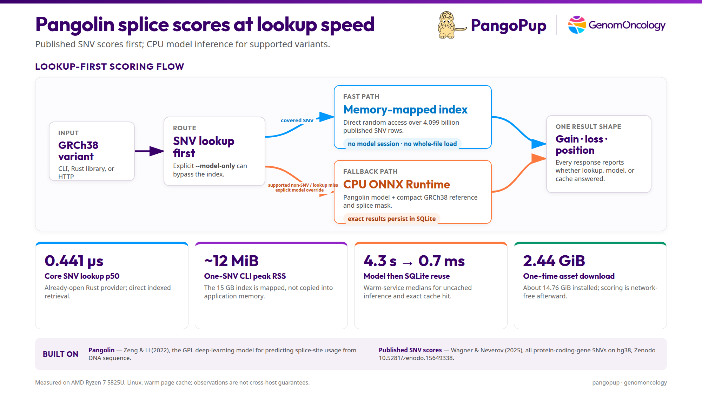

# PangoPup

PangoPup is an open-source, GPL-licensed Rust service built on the
[Pangolin](https://github.com/tkzeng/Pangolin) model. It provides fast, local splice
predictions for GRCh38 variants. For each variant, it reports the strongest predicted splice-site
gain and signed loss together with each result's genomic-coordinate offset.
The scores help identify variants that may alter RNA splicing.

For single-nucleotide variants (SNVs), PangoPup first checks a memory-mapped index of
published scores. A supported lookup miss or non-SNV runs through the Pangolin model on
the CPU, and modeled results are saved in SQLite for reuse. The reported search region is
50 bases on either side of the variant; for a deletion, its allele span can extend the
positive offset beyond 50.



PangoPup was built by [GenomOncology](https://genomoncology.com/), which also makes
[BioMCP](https://biomcp.org/).

<details>
<summary><strong>Performance overview in text</strong></summary>

PangoPup routes a covered SNV to the published-score index. A supported non-SNV, supported lookup miss, or explicit `--model-only` request runs through the Pangolin model with CPU ONNX Runtime. Exact modeled results are saved in SQLite, so the same request can be reused without another inference. The 15 GB SNV index is memory-mapped. Linux and macOS bring in only the file pages a query touches and may reclaim those pages instead of copying the whole index into application memory. Every score reports whether a precomputed lookup, the Pangolin model, or the SQLite cache answered it.

Retained measurements are an already-open filtered SNV lookup p50 of **0.441 µs**; about
**12 MiB** peak RSS for a one-SNV CLI call; **4.3 s → 0.7 ms** median for uncached model
inference followed by a fresh-service SQLite hit; and a **2.44 GiB** asset download with
about **14.76 GiB** installed. These are warm-page-cache observations on an AMD Ryzen 7
5825U running Linux, not cross-host guarantees. See the retained
[lookup benchmark](planning/artifacts/004-snv-lookup-performance.md) and
[runtime measurements](planning/artifacts/053-current-runtime-resources.md).

The two principal prior works are the [Pangolin model and software](https://github.com/tkzeng/Pangolin)
by Zeng and Li and the [published Pangolin SNV scores](https://doi.org/10.5281/zenodo.15649338)
by Wagner and Neverov.

</details>

## Quick start

The direct executable requires Linux x86-64/amd64 with GLIBC 2.39 or newer. The first
sync downloads about 2.44 GiB, installs about 14.76 GiB, and needs at least 25 GB free.

```bash
curl -fsSL https://raw.githubusercontent.com/genomoncology/pangopup/v0.3.0/install.sh \
  | bash -s -- --version 0.3.0
export PATH="$HOME/.local/bin:$PATH"

pangopup sync --progress
pangopup status
pangopup lookup --variant GRCh38:chr12:6801301:G:A
pangopup lookup --variant GRCh38:chr12:6801303:G:GA
```

After `sync`, scoring is network-free. The SNV normally uses the precomputed index; the
supported insertion automatically uses the model. Both commands return JSON Lines.
Native macOS uses the same commands after a source install. The Storage and operations section shows that path.

## Input and output

Literal variants use `GRCh38:CONTIG:POS:REF:ALT` with a 1-based genomic position. Accepted
contigs are `1`–`22`, `X`, `Y`, `M`, `MT`, their `chr` forms, or the corresponding installed
RefSeq accessions. Alleles must be nonempty uppercase strings containing only A, C, G,
or T.

PangoPup uses the submitted representation exactly; it does not trim, align, or
normalize alleles. Insertions and deletions use an anchored form: the REF and ALT alleles
share the first base, and one allele is one base long. Model scoring checks REF against the
installed GRCh38 reference and accepts at most 100 bases in either allele. Equal-length
substitutions are also supported.

Exact indels omit padding. `GRCh38:CONTIG:INS:LEFT:RIGHT:SEQUENCE` requires adjacent one-based coordinates. `GRCh38:CONTIG:DEL:START:END:SEQUENCE` uses an inclusive interval with matching sequence length and cannot start at one. Sequences contain 1–99 uppercase A/C/G/T bases. PangoPup reads the left anchor and verifies deletions against its reference before routing and caching.

```bash
# Score a batch and render a tab-separated table.
pangopup lookup \
  --variant GRCh38:chr12:6801301:G:A \
  --variant GRCh38:chr12:6801303:G:GA \
  --format table

# Keep records for one gene. Versioned GENCODE and `_PAR_Y` forms also work.
pangopup lookup --variant GRCh38:chr12:6801301:G:A \
  --gene ENSG00000010610

# Bypass the SNV index and run the model explicitly.
pangopup lookup --model-only \
  --variant GRCh38:chr1:INS:5051:5052:C

```

JSON Lines is the default format. Each result contains a `status`, zero or more gene
`records`, and provenance. Overlapping genes can produce multiple records. Status means:

- `found`: at least one score record was produced with no source-reference ambiguity.
- `not_found`: no score record was produced for the request and optional gene filter;
  this is not a prediction of zero effect.
- `ambiguous_source_reference`: the precomputed source used `N` as its reference at the
  locus, so its source-associated gene, published alternate alleles, and omitted alternate are reported instead of a score.
- `mixed`: score records and a source-reference ambiguity both occurred, which can happen
  across overlapping genes.

A score record contains `gain_score`, `gain_position`, `loss_score`, and `loss_position`.
Loss is signed, and positions are offsets from the submitted genomic position. A positive
position always means a higher genomic coordinate, including for a minus-strand gene.
`provenance.kind` is `precomputed` for an index result or `model` for model inference or
an exact SQLite reuse.

Run `pangopup <command> --help` for command-specific options.

## HTTP service

Start the foreground service on loopback:

```bash
pangopup serve --listen 127.0.0.1:8080
```

```bash
curl -fsS http://127.0.0.1:8080/readyz

curl -fsS http://127.0.0.1:8080/v1/score \
  -H 'content-type: application/json' \
  --data '{"variants":["GRCh38:chr12:6801301:G:A","GRCh38:chr12:6801303:G:GA"]}'

curl -fsS http://127.0.0.1:8080/v1/score \
  -H 'content-type: application/json' \
  --data '{"variants":["GRCh38:chr12:6801301:G:A"],"model_only":true}'

```

Health and status routes are `/livez`, `/readyz`, and `/v1/status`. Status reports the client limits and input forms under `request_contract`. Status and score items share the `scoring_identity`. Store this identity as the data-set version when a system has one version field. Retain detailed provenance. `/v1/score` requires one `Content-Type: application/json` field. Case and legal parameters are accepted. Invalid, missing, and repeated content types receive HTTP 415. The route accepts 1–100 variants and at most the reported `max_uncached_model_items`. This limit is the smaller of queue capacity and 10 uncached model variants. Larger requests receive HTTP 422 with `MODEL_BATCH_TOO_LARGE`. A valid batch, including an all-rejected batch, returns HTTP 200 and one ordered outcome per input. HTTP status describes batch processing. Item status describes annotation. Invalid values preserve `input` and use `error.code: "INVALID_VARIANT"`. Normalized model rejections use `error.code: "MODEL_REJECTED"`. Both use `status: "rejected"`, empty `records` and `source_reference_ambiguities`, and no provenance. Scoring, cache, worker, and readiness failures invalidate the request. Temporary saturation returns HTTP 429 with `Retry-After`. The service has no built-in authentication or TLS. Keep it behind an authenticated TLS reverse proxy unless it listens only on loopback. Use an external process manager.

`--model-queue-capacity` bounds running and queued uncached model variants and defaults to 20. Lookup and completed SQLite hits use no units. Status reports the same `uncached_model_variant` units. A temporary HTTP 429 sets `Retry-After` to `ceil((running + queued) × 10.241)` seconds. This conservative guidance uses the slowest retained p50 and does not promise capacity.

## Docker

The published image supports native Linux AMD64 and ARM64. Create persistent volumes,
sync once, then start the service:

```bash
export PANGOPUP_IMAGE=ghcr.io/genomoncology/pangopup:0.3.0
docker pull "$PANGOPUP_IMAGE"
docker volume create pangopup-data
docker volume create pangopup-cache

docker run --rm \
  -v pangopup-data:/var/lib/pangopup \
  -v pangopup-cache:/var/cache/pangopup \
  "$PANGOPUP_IMAGE" sync --progress

docker run --rm --name pangopup -p 127.0.0.1:8080:8080 \
  -v pangopup-data:/var/lib/pangopup:ro \
  -v pangopup-cache:/var/cache/pangopup \
  "$PANGOPUP_IMAGE"
```

Use the image as a CLI without starting the server:

```bash
docker run --rm --network none \
  -v pangopup-data:/var/lib/pangopup:ro \
  -v pangopup-cache:/var/cache/pangopup \
  "$PANGOPUP_IMAGE" lookup --variant GRCh38:chr12:6801301:G:A
```

Removing or replacing a container preserves both named volumes. Apple Silicon runs the
ARM64 image through Docker Desktop; model inference is CPU-only and does not use MPS or
Metal.

## Storage and operations

| Component | Download | Installed |
|---|---:|---:|
| SNV lookup | ~1.80 GiB | ~14.00 GiB |
| Model, reference, and mask | ~660 MiB | ~775 MiB |
| Combined | ~2.44 GiB | ~14.76 GiB |

The SNV index is memory-mapped rather than loaded wholly into RAM. Linux and macOS read the file pages touched by queries and can reclaim them through the normal page cache. For one default foreground service, 256 MiB RAM is a practical starting allocation. Measure against your workload before setting a production limit.

By default on Linux and macOS, installed assets are in `~/.local/share/pangopup`; resumable downloads are in `~/.cache/pangopup`; and model results are in `~/.cache/pangopup/model-results.sqlite3`.

### Native macOS

PangoPup supports native macOS through a source install. The project does not publish a macOS executable or executable installer yet. Install the Rust toolchain named in `rust-toolchain.toml`, then run:

```bash
git clone https://github.com/genomoncology/pangopup.git
cd pangopup
cargo install --locked --path crates/pangopup-cli
pangopup sync --progress
pangopup status
pangopup serve --listen 127.0.0.1:8080
```

Native macOS inference uses CPU ONNX Runtime. It does not use MPS or Metal. `pangopup uninstall` refuses on macOS. Manage the Cargo-installed executable and XDG asset directories directly.

Verify an existing installation without network access:

```bash
pangopup sync --offline
pangopup status
```

To install a chosen release, use its version in both the URL and installer argument:

```bash
VERSION=0.3.0
curl -fsSL "https://raw.githubusercontent.com/genomoncology/pangopup/v${VERSION}/install.sh" \
  | bash -s -- --version "$VERSION"
```

This replaces the executable while preserving assets and caches. Run
`pangopup sync --offline` to confirm reuse, or `pangopup sync --progress` when the chosen
release requires different assets.

For Docker, pull the chosen tag, stop the container started above, then repeat the same
service command with both named volumes:

```bash
export PANGOPUP_IMAGE=ghcr.io/genomoncology/pangopup:0.3.0
docker pull "$PANGOPUP_IMAGE"
docker stop pangopup
```

Replacing the container preserves the data and cache volumes.

For native Linux removal, PangoPup displays every resolved path before asking what to delete:

```bash
pangopup uninstall              # choose code only, full removal, or cancel
pangopup uninstall --yes        # code only, without prompting
pangopup uninstall --full       # code, managed data, and cache; asks first
pangopup uninstall --full --yes # full removal without prompting
```

For Docker, remove code with `docker image rm ghcr.io/genomoncology/pangopup:0.3.0`.
Optionally remove downloads and cached model results with
`docker volume rm pangopup-cache`, or installed assets with
`docker volume rm pangopup-data`.

## Citation and license

To cite PangoPup, use [`CITATION.cff`](CITATION.cff). PangoPup is
[GPL-3.0-only](LICENSE). Exact source identities, modifications, and attribution are in
[`NOTICE`](NOTICE) and [`assets/notices/`](assets/notices/).

PangoPup builds on these works:

- **Pangolin software** — Tony Zeng,
  [GPL-3.0 source](https://github.com/tkzeng/Pangolin).
- **Pangolin paper** — Tony Zeng and Yang I. Li, “Predicting RNA splicing from DNA
  sequence using Pangolin,” *Genome Biology* 23, 103 (2022),
  [DOI 10.1186/s13059-022-02664-4](https://link.springer.com/article/10.1186/s13059-022-02664-4).
- **Pangolin precomputed scores** — Nils Wagner and Aleksandr Neverov,
  [Zenodo DOI 10.5281/zenodo.15649338](https://doi.org/10.5281/zenodo.15649338),
  licensed under [CC BY 4.0](https://creativecommons.org/licenses/by/4.0/).
- **GENCODE v38** — source annotation used for splice-site masking; see
  [`NOTICE`](NOTICE) for the pinned source and terms.
